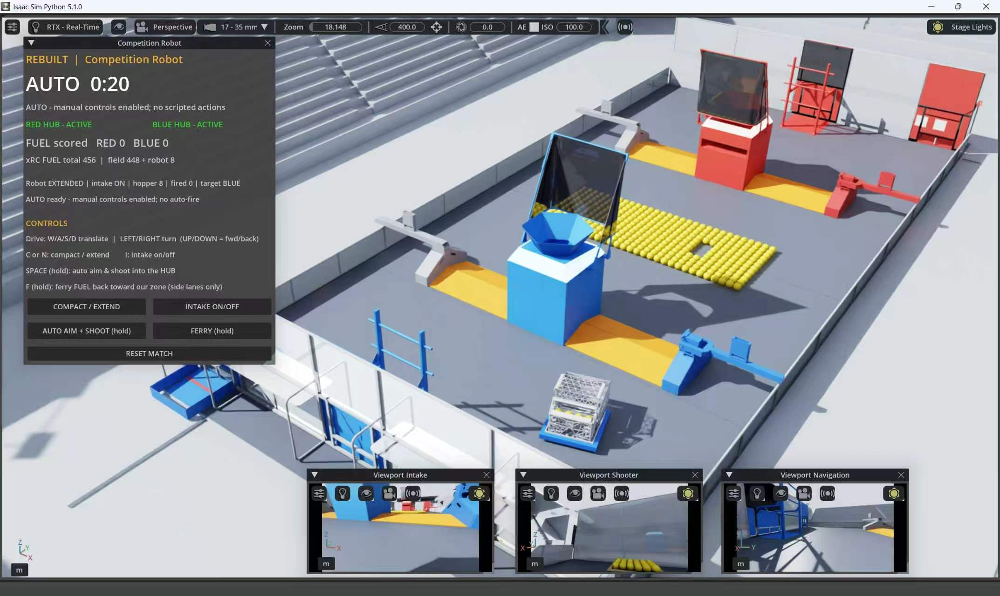

# FRC REBUILT Reinforcement Learning

After the 2026 New York Regional, I wondered whether the human driver could be
replaced by a policy that learned from experience rather than scripted
autonomous paths. No full REBUILT learning environment existed for the problem
I wanted to study, so I built one.

I developed an end-to-end reinforcement-learning project that teaches a
simulated competition robot to play the FRC REBUILT game autonomously. I
reconstructed the field and a detailed robot in NVIDIA Isaac Sim, including
realistic mechanisms, scoring rules, match timing, and 456 individually
simulated game pieces, then built a camera-based learning system that progressed
through four increasingly difficult training stages to full 160-second matches.
Beyond training the model across multiple GPUs, I created rigorous evaluation
and checkpoint-selection procedures, analyzed failures, documented experimental
results, and produced a verified score-201 match video with real-time telemetry
and multiple camera views. This project taught me that ambitious engineering is
not just about achieving one impressive result—it requires patience,
reproducibility, honest reporting, and the willingness to repeatedly diagnose
and improve an interconnected system.

The highest recorded Stage-D full-match rollout scored **218 FUEL** in 160
seconds. The public video below documents a separate, provenance-verified
**201-point** match.



> **[Read the complete Stage A-D technical report](docs/TECHNICAL_REPORT.md)**
> for the experimental contracts, fixed-checkpoint comparisons, limitations,
> and artifact provenance behind the headline results. Exact selected model
> identities are recorded in **[the checkpoint manifest](models/SELECTED_MODELS.tsv)**.

The project models the field, match clock, HUB activation schedule, 456 FUEL,
robot mechanisms, legal scoring, and randomized HUB returns. Policies act from
three chassis-mounted cameras while the simulator retains privileged state only
for training critics, diagnostics, and evaluation.

## Project status

| Status | Evidence |
|---|---|
| Software-validated | Physics scene, robot mechanisms, camera observations, distributed DrQ-v2 training, deterministic evaluation, and immutable checkpoint promotion. |
| Measured | Stage-A and Stage-C episode rows, plus Stage-D paired aggregates, checkpoint hashes, caveats, and generated figures, are published. |
| Evidence gap | Stage B currently has a resume/training smoke test but no fixed checkpoint evaluation. Independent learner-seed replication is also still missing. |
| Planned | Controlled ablations, broader vision robustness tests, and physical-robot transfer. No sim-to-real result is claimed yet. |

See the [Stage A-D technical report](docs/TECHNICAL_REPORT.md), the concise
[results index](docs/EXPERIMENT_RESULTS.md), and the
[machine-readable A-D dataset](results/stage_abcd_experiment_results.json).

<a id="demo"></a>
## Demo — Stage D

https://github.com/user-attachments/assets/518c0220-82ed-45f1-b8d7-8007a5b0ea4c

[Reproduction guide](docs/VIDEO_RENDER_WORKFLOW.md) ·
[Public provenance](docs/media/score201-public-provenance.json)

## Training progression

These short artifacts show how the task grew. Scores are not compared across
stages because duration, FUEL count, reset distribution, and learning objective
change with each contract.

**Early physics prototype** — primitive geometry used to validate contact,
motion, and camera observations before the detailed field; not learned-policy
evidence.

https://github.com/user-attachments/assets/9df55a7a-1672-49b1-ac67-1ba2833dac5c

**Stage A: visual acquisition** — matched 20-second, 32-FUEL replay. The frozen
checkpoint collected 17 FUEL on the selected shared reset key while the random
controller collected 0.

https://github.com/user-attachments/assets/8a15cf43-cda3-4fb2-8d54-3046949b891c

**Stage B: acquisition to scoring** — all 360 recorded rows from a historical
36-second, 96-FUEL diagnostic, presented as a top-down telemetry animation. The
selected episode collected and scored 32; this is process evidence, not a
formal Stage-B promotion claim or camera footage.

https://github.com/user-attachments/assets/b28d9601-418a-41a4-bf05-9f8be3c2eb3a

**Stage C: repeated cycles** — selected excerpts from an authentic exploratory
curriculum episode with three actor cameras and live phase telemetry. The
episode scored 90 and completed two cycles; it is not a fixed deterministic
benchmark.

https://github.com/user-attachments/assets/cd39028a-a5e0-45e3-8ba9-984948426925

## Technical report: Stage A–D experiment

**[Read the complete Stage A–D technical report →](docs/TECHNICAL_REPORT.md)**

[Concise results index](docs/EXPERIMENT_RESULTS.md) · [Machine-readable results](results/stage_abcd_experiment_results.json)

Results are grouped into four curriculum stages rather than treating every
score as one continuous metric. Each published evidence block uses a frozen
contract, but Stage C contains separate 90- and 120-second contracts that must
not be pooled.


| Stage | Frozen contract | Evidence | Headline result |
|---|---:|---|---|
| **A — basic collection** | 20 s, 32 FUEL | Fixed 6-episode diagnostic | Checkpoint collected **16.50 ± 2.59** FUEL versus **4.83 ± 5.23** for the random baseline. Scoring remained sparse: five of six checkpoint episodes scored zero. |
| **B — vectorized transition** | 36 s, 96 FUEL | Resume/training smoke run | **2,450 transitions**, **1,452 updates**, and **6.636 transitions/s** across six episodes. This validates the training pipeline, not fixed-policy performance. |
| **C — deterministic autonomy** | 90/120 s, 200 FUEL | Fixed deterministic blocks | The 90-second champion scored **41.50 ± 16.32** (`n=8`); the 120-second v2 block reached **68.80 ± 10.32** (`n=10`); the four-seed bank averaged **80.33 ± 6.35** across 6 healthy horizons of 8 total (all-row mean **77.25 ± 8.92**). |
| **D — full-match retention** | 160 s, 456 FUEL | Exact matched-seed paired evaluations | FSG8 had a **+20.41** higher observed paired mean than its source on the fixed block; FSG9 was **+9.20** over FSG8; FSG10 checkpoint 3270 was **−11.34** below FSG9 and was rejected. |

Values shown as mean ± spread use the sample standard deviation.


### Stage-D checkpoint decisions

| Comparison | Common healthy pairs | Paired candidate mean | Paired baseline mean | Paired delta | Decision |
|---|---:|---:|---:|---:|---|
| FSG8 v3215 vs source v3185 | 44 | 121.16 | 100.75 | **+20.41** | Promoted |
| FSG9 v3230 vs FSG8 v3215 | 46 | 122.78 | 113.59 | **+9.20** | Promoted |
| FSG10 v3270 vs FSG9 v3230 | 41 | 117.73 | 129.07 | **−11.34** | Rejected |


Each Stage-D comparison requested 64 rows per model. Means use common healthy
keys and retain healthy zero-score episodes; full health counts are reported in
the technical report.

Raw scores are not directly comparable across Stages A–D because the contracts
change. The Stage-D confidence intervals cross zero, so promotion decisions are
evidence-based engineering gates rather than claims of statistical
significance. Stage B currently has smoke evidence only, independent
learner-seed replication has not yet been performed, and no simulation-to-real
validation is claimed.

Additional figures: [Stage A diagnostic](docs/figures/stage-a-diagnostic.svg) ·
[Stage A learning](docs/figures/stage-a-learning.svg) ·
[Stage C deterministic results](docs/figures/stage-c-deterministic.svg) ·
[Stage C checkpoint progression](docs/figures/stage-c-matched-progression.svg) ·
[Stage D evaluation health](docs/figures/stage-d-health.svg) ·
[Vectorized throughput](docs/figures/vectorized-throughput.svg)

## What is included

- A full-physics Isaac Sim field with both HUBS, BUMPS, TRENCHES, towers,
  sources, walls, AprilTag plates, dynamic FUEL, lighting, and scoring rules.
- A detailed swerve-drive robot with intake, hopper, feeder, turret, flywheel,
  compact/extended geometry, collision proxies, and calibrated shooting.
- Interactive manual operation with intake, shooting, ferrying, emergency stop,
  and live intake/shooter/navigation camera views.
- Vectorized environments and distributed GPU collectors for camera-based
  DrQ-v2 training.
- Full-match curricula, deterministic checkpoint evaluation, immutable
  checkpoint promotion, teacher-bank curation, and training dashboards.
- CPU-focused regression tests for policy, replay, distributed transport,
  curriculum, checkpoint custody, evaluation, and safety contracts.

## Architecture

```text
REBUILT field assets and official FRC rules
        |
        +-- Isaac field, PhysX FUEL, HUB routing, and match timing
        |
        +-- competition robot controller and three onboard cameras
                |
                +-- interactive simulator
                |
                +-- vectorized full-physics environments
                        |
                        +-- distributed collectors
                        +-- DrQ-v2 learner
                        +-- deterministic evaluation and promotion
```

The actor receives camera observations and the public robot state. Training may
use an asymmetric critic, but evaluation always runs the policy under the
deterministic full-physics contract.

## Quick start

Development prerequisites:

- Windows 11
- NVIDIA Isaac Sim 5.1
- Isaac Lab
- Python 3.11 and a CUDA-enabled PyTorch build

Launch the interactive simulator:

```powershell
$env:OMNI_KIT_ACCEPT_EULA='YES'
& C:\il\venv\Scripts\python.exe .\run_sim.py --max-fuel 456
```

You can also double-click `LaunchSimulator.exe` when using the development
machine layout.

Controls:

- `W/S`: field-forward/back
- `A/D`: field-left/right
- left/right arrows: rotate
- `I`: intake
- `N`: compact/extend
- hold `SPACE`: aim and shoot into the blue HUB
- hold `F`: ferry toward the alliance zone
- `E`: emergency stop

## Training and evaluation

The main implementation lives in `src/frc_rebuilt/rl`, with launchers and
operational tools in `scripts/rl`. The current full-speed Foundation workflow
uses:

- one learner and distributed camera collectors;
- full 160-second deterministic evaluation horizons;
- critic-only warm-up followed by interval-controlled actor updates;
- balanced teacher sampling across opener, live-period, and endgame windows;
- exact checkpoint hashes and immutable promotion records.

Start with the server setup guide for Linux GPU training:
[`README_SERVER.md`](README_SERVER.md).

Useful entry points:

```bash
# Train a local DrQ-v2 baseline
python scripts/rl/train_drqv2.py --stage B --num-envs 2 --minutes 120 \
  --out runs/drqv2_stageB

# Evaluate an immutable checkpoint
python scripts/rl/eval_checkpoint.py \
  --checkpoint /path/to/checkpoint.pt \
  --episodes 12 --episode-len-s 160 \
  --out runs/eval_checkpoint.json

# Open the local training dashboard
python scripts/rl/training_dashboard.py
```

Generated checkpoints, run captures, logs, and machine-specific recovery data
are intentionally excluded from Git. They should be stored in dedicated local
or remote experiment storage with their provenance records.

## Verification

CPU regression suite:

```powershell
& C:\il\venv\Scripts\python.exe -m pytest -q
```

Isaac Sim validation tools:

```powershell
& C:\il\venv\Scripts\python.exe tools\validate_competition_robot.py
& C:\il\venv\Scripts\python.exe tools\validate_robot_drive_intake.py
& C:\il\venv\Scripts\python.exe tools\validate_robot_trench_mode.py
& C:\il\venv\Scripts\python.exe tools\validate_hub.py
```

## Repository layout

| Path | Purpose |
|---|---|
| `src/frc_rebuilt/` | Field, rules, robot controller, and RL implementation |
| `scripts/rl/` | Training, evaluation, curation, launch, and monitoring tools |
| `tests/` | CPU and integration regression tests |
| `tools/` | Asset, geometry, and simulator validation utilities |
| `docs/` | Architecture, rules, audits, and runbooks |
| `assets/` | Runtime field and robot assets |
| `results/` | Sanitized, machine-readable experiment summaries |

## License and third-party material

Original project-authored source code and documentation are available under the
[MIT License](LICENSE). Extracted simulator interoperability data, supplied/vendor
CAD, derived meshes, documentation captures, trademarks, and separately
licensed dependencies are not relicensed under MIT. Review
[`THIRD_PARTY_NOTICES.md`](THIRD_PARTY_NOTICES.md) before redistributing assets.
