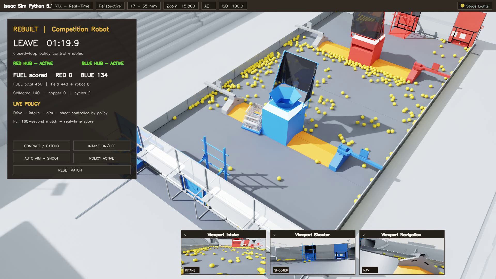

# Camera-based reinforcement learning for FRC REBUILT

## Stage A-D technical report

- **Environment:** NVIDIA Isaac Sim 5.1 / Isaac Lab
- **Machine-readable results:** [`results/stage_abcd_experiment_results.json`](../results/stage_abcd_experiment_results.json)

## Abstract

This project investigates whether a camera-based reinforcement-learning policy
can progress from short-horizon FUEL acquisition to full 160-second autonomous
play in a physics simulation of the FRC REBUILT game. The implemented policy is
an off-policy DrQ-v2 agent whose actor consumes three onboard RGB views and
public robot state; its critic may use privileged simulator state during
training. A staged curriculum increases the horizon and task difficulty from
20-second, 32-FUEL acquisition (Stage A), through mixed-start acquisition and
scoring (Stage B), repeated collection/return/scoring behavior (Stage C), to an
exact-timing, 456-FUEL full match (Stage D).

The available evidence is uneven by stage and is therefore reported in four
explicit tiers. Stage A has a small fixed diagnostic in which the checkpoint
collected 16.50 FUEL on average versus 4.83 for a random policy. Stage B has a
successful training-resume smoke test but no publication-grade fixed
checkpoint evaluation. Stage C has several deterministic diagnostic blocks:
the strongest multi-seed 90-second bank averaged 80.33 scored FUEL over its six
healthy rows, while a 120-second matched progression reached 71.33 over 12
rows at the latest checkpoint. Stage D provides the strongest evidence:
immutable checkpoints were compared on identical deterministic evaluator keys.
Two candidates passed the engineering promotion gate with observed paired-mean
deltas of +20.41 and +9.20, while a later candidate was rejected at -11.34.

These results demonstrate a working simulated training and checkpoint-selection
pipeline, not statistical proof of generalization. The Stage-D descriptive 95%
intervals all span zero; training has not yet been replicated over 3-5
independent learner seeds; and no physical-robot or sim-to-real result is
claimed.

## Full-match video evidence

This complete 160-second H.264 match renders a checksum-verified 1,600-step
Stage-D visual-state trace. The score progresses from 0 to 201; the run
collected 207 FUEL and completed five cycles. Every frame restores the robot,
mechanisms, and all 456 FUEL poses without advancing physics. See the
[web video](https://github.com/nickjizheng/FRC-REBUILT-Reinforcement-Learning/releases/download/v1.0.0/frc-rebuilt-score-201-full-match-web.mp4),
[high-quality 1080p video](https://github.com/nickjizheng/FRC-REBUILT-Reinforcement-Learning/releases/download/v1.0.0/frc-rebuilt-score-201-full-match.mp4),
[public provenance record](media/score201-public-provenance.json)
and [video-render workflow](VIDEO_RENDER_WORKFLOW.md) for the custody chain and
repeatable procedure.

## 1. Scope and evidence policy

Raw score is meaningful only within one frozen contract. Stages differ in
horizon, FUEL count, reset distribution, scoring rules, and historical action
semantics, so this report never treats A-D score as one continuous dependent
variable.

| Evidence tier | Meaning | Permitted conclusion |
|---|---|---|
| **Fixed paired** | Immutable candidate and baseline evaluated on identical keys under one contract | Engineering promotion/rejection on that fixed block |
| **Fixed diagnostic** | Frozen checkpoint evaluation with limited sample size or incomplete historical provenance | Behavior observed on the stated block |
| **Directional** | Moving-policy training telemetry | Why a checkpoint was screened, not how a fixed policy performs |
| **Smoke** | Short infrastructure, resume, or throughput validation | The pipeline ran; no competence claim |

The consolidated JSON preserves the full public numerical record, including
per-episode rows where those rows are available, artifact SHA-256 values, and
the caveats attached to each block.

## 2. System and learning method

### 2.1 Simulation and robot

The environment models the REBUILT field, dynamic FUEL, HUB routing and
activation, match time, legal scoring, and a swerve-drive competition robot
with physical intake, storage, feeder, turret, and shooter mechanisms. The
policy cannot directly place or score FUEL. Shooting remains mediated by the
simulated mechanism and legal-score path. Environment and mechanism checks are
documented in the [rules](RULES.md), [HUB validation](HUB_VALIDATION.md), and
[camera specification](CAMERAS.md).

### 2.2 Observations, actions, and critic asymmetry

The actor receives three 640 x 360 onboard RGB streams (intake, shooter, and
navigation) plus public robot state. Training downsamples each image by four to
160 x 90 and channel-stacks the three RGB images into a 9-channel tensor. The
continuous seven-dimensional policy action controls field-relative drive,
turn, intake, storage, shooting, and ferry requests through the robot
controller. The critic may additionally observe privileged simulator state,
but deterministic evaluation executes only the actor contract. The implemented
preprocessing and stage contracts are defined in
[`scripts/rl/train_drqv2.py`](../scripts/rl/train_drqv2.py).

### 2.3 Optimization and custody

Training uses DrQ-v2 with visual augmentation, an asymmetric critic, n-step
off-policy replay, and finite-only checkpoint writes. Later stages use
distributed camera collectors feeding one learner. Full-match development adds
behavior-only teacher banks and time-window-balanced imitation, but promotion
is decided by isolated deterministic checkpoint evaluation rather than live
training return. Promoted artifacts are immutable and identified by SHA-256;
`latest.pt` is never treated as a promotion artifact.

## 3. Curriculum and experimental contracts

| Stage | Horizon | FUEL template | Reset/scoring contract | Primary objective | Best public tier |
|---|---:|---:|---|---|---|
| A | 20 s | 32 | Short acquisition episodes | Acquire visible FUEL | Fixed diagnostic |
| B | 36 s | 96 | Mixed cold, preloaded, and ramp-teaching starts | Acquire and score | Smoke |
| C | 90 or 120 s | 200 | Compact trench start; historical sandbox and action revisions | Repeat collect-return-score behavior | Fixed diagnostic |
| D | 160 s | 456 | Exact full-match timing; deterministic actor mean; auxiliaries disabled | Maximize legal full-match score | Fixed paired |

Stage B's published smoke run used a 0.50 preloaded-start probability and a
collection-weight schedule from 1.5 to 0.3. This is the configuration of that
historical run, not a claim that every later Stage-B branch used the same
values. Stage C's 90-second one-ball-per-press evaluations and later
dump-on-press evaluations are deliberately kept in separate result blocks.

## 4. Evaluation and statistical method

For every result, the unit of analysis is the evaluator episode or exact
evaluator key, not a training log line. `mean +/- SD` denotes the arithmetic
mean and sample standard deviation over the stated rows. Medians and ranges are
included because score distributions contain rare collapses and are not well
summarized by the mean alone.

Stage-D comparisons use 64 requested rows per model, the same seed block for
candidate and baseline, deterministic actor-mean actions, policy speed 1.0,
and 160-second horizons. A row is healthy only when it reaches the horizon
under the exact checkpoint and evaluator contract. Healthy zero scores are
retained. Paired statistics use only keys healthy for both models; all-healthy
counts and summaries are reported separately so pair filtering cannot conceal
different completion rates.

The Stage-D intervals are two-sided Student-t intervals calculated from the
published paired-delta mean, paired-delta SD, and common-healthy sample size.
They are descriptive: they are not adjusted for repeated checkpoint screening,
and no null-hypothesis claim is made. The three Stage-D comparisons use
different seed blocks and must not be pooled or arithmetically chained.

## 5. Stage A: visual acquisition

### 5.1 Training telemetry

The selected Stage-A run accumulated 105,970 transitions, 104,972 learner
updates, and 528 completed episodes. Its final recent-window summaries were a
24.81 return, 25.35 collection reward, and 4.00 score reward. These are shaped
training quantities from a moving policy, not fixed-evaluation outcomes.

| Transitions | Updates | Episodes | Last-20 return | Last-20 collection reward | Last-20 score reward |
|---:|---:|---:|---:|---:|---:|
| 105,970 | 104,972 | 528 | 24.81 | 25.35 | 4.00 |

### 5.2 Fixed diagnostic

The recovered checkpoint has SHA-256
`94627ce74e30f96a378bb25288ffb69bb7122b687100d49c73a5c3ffd0b83c65`.
It was compared with random and zero-action policies over six episodes each.

| Policy | n | Return, mean +/- SD | Collected, mean +/- SD | Collected median [min, max] | Scored, mean +/- SD | Shots, mean +/- SD |
|---|---:|---:|---:|---:|---:|---:|
| Checkpoint | 6 | 31.65 +/- 28.57 | **16.50 +/- 2.59** | 16 [13, 21] | 1.17 +/- 2.86 | 2.33 +/- 5.72 |
| Random | 6 | 5.23 +/- 7.83 | 4.83 +/- 5.23 | 2 [1, 12] | 0.00 +/- 0.00 | 0.33 +/- 0.82 |
| Zero action | 6 | 0.00 +/- 0.00 | 0.00 +/- 0.00 | 0 [0, 0] | 0.00 +/- 0.00 | 0.00 +/- 0.00 |

The acquisition result is the relevant Stage-A evidence. The checkpoint score
mean is dominated by one seven-score episode; five of six checkpoint episodes
scored zero. The historical evaluation JSON did not embed its evaluator
revision or checkpoint hash, so the identity was recovered from the
contemporaneous repository state. This is a small diagnostic block, not an
independent training-seed replication.

Sources: [`runs/drqv2_stageA_clean/summary.json`](../runs/drqv2_stageA_clean/summary.json),
[`runs/drqv2_stageA_clean/metrics.jsonl`](../runs/drqv2_stageA_clean/metrics.jsonl),
and [`runs/eval_stageA_clean.json`](../runs/eval_stageA_clean.json).

## 6. Stage B: acquire-and-score transition

The available Stage-B public artifact is intentionally classified as a smoke
test. It verifies that a Stage-A checkpoint could be resumed into the
36-second, 96-FUEL mixed-start training configuration and that replay and
updates advanced without presenting those six episodes as a learned scoring
result.

| Wall time | Transitions | Updates | Episodes | Throughput | Return, mean +/- SD | Recent collection reward | Recent score reward |
|---:|---:|---:|---:|---:|---:|---:|---:|
| 369.2 s | 2,450 | 1,452 | 6 | 6.636 tx/s | 26.79 +/- 12.99 | 33.0 | **0.0** |

The collection value is shaped reward, not a raw FUEL count. No fixed
Stage-B checkpoint evaluation with a frozen evaluator revision, checkpoint
hash, seed keys, and cold-start result block is available. Therefore this
report makes no Stage-B policy-performance claim. A complete follow-up should
evaluate an immutable Stage-B checkpoint against the Stage-A checkpoint,
random actions, and a simple rule-based baseline on the same 36-second
cold-start keys.

Sources: [`runs/drqv2_stageB_smoke/summary.json`](../runs/drqv2_stageB_smoke/summary.json)
and the sanitized fields in the consolidated results JSON.

## 7. Stage C: repeated collection and scoring

Stage C contains multiple historical contracts. Results are shown separately
by horizon and action semantics.

### 7.1 Legacy deterministic 90-second block

Both checkpoints used the 200-FUEL template, seed 424242, compact trench
starts, deterministic actions, and one-ball-per-press shooting semantics.

| Checkpoint | SHA-256 prefix | Train steps | n | Score, mean +/- SD | Median [min, max] | Collected, mean +/- SD | Score/shot | Decision |
|---|---|---:|---:|---:|---:|---:|---:|---|
| Champion 998753 | `a4778ad54995` | 998,753 | 8 | **41.50 +/- 16.32** | 48 [2, 50] | 58.25 +/- 4.23 | 0.8040 | Retain |
| Retest 1019053 | `acce25a2b0db` | 1,019,053 | 8 | 32.75 +/- 19.92 | 42.5 [0, 48] | 55.13 +/- 5.87 | 0.7638 | Do not promote |

The retest still collected substantial FUEL but developed two late failures in
which it rarely attempted shots, demonstrating that collection alone was not a
sufficient checkpoint-selection metric.

### 7.2 Deterministic 120-second v2 block

A later dump-on-press checkpoint (SHA-256
`9f401501da13da8ad6d4cba22b99bc03eefcd4cdbb9256a948df7f90d25f4689`)
was evaluated for ten 120-second episodes across two environments.

| n | Score, mean +/- SD | Median [min, max] | Collected, mean +/- SD | Shots, mean +/- SD | Successful rows | Completed cycles |
|---:|---:|---:|---:|---:|---:|---:|
| 10 | 68.80 +/- 10.32 | 72.5 [52, 86] | 86.20 +/- 7.38 | 79.90 +/- 10.24 | 7/10 | 8 |

Success in this historical block was an evaluator-defined cycle outcome; it is
not interchangeable with Stage-D health or full-match success.

### 7.3 Matched 120-second checkpoint progression

Four immutable checkpoints were evaluated on the same 12 deterministic keys
from seed blocks 7192026 and 7192027.

| Model | SHA-256 prefix | n | Score, mean +/- SD | Median [min, max] | Collected, mean +/- SD |
|---|---|---:|---:|---:|---:|
| 835k | `47d14ebbc41f` | 12 | 64.83 +/- 20.85 | 71 [3, 79] | 86.33 +/- 11.40 |
| 840k | `1113accf3c29` | 12 | 66.08 +/- 7.60 | 63.5 [57, 77] | 86.83 +/- 7.21 |
| 845k | `3f2a5d64e88c` | 12 | 68.83 +/- 22.11 | 76 [1, 81] | 87.25 +/- 4.45 |
| Latest 2014905 | `94d27d391392` | 12 | **71.33 +/- 24.44** | 78 [0, 95] | **90.92 +/- 10.74** |

The latest checkpoint had the highest mean and maximum, but its zero-score row
and large SD show that mean improvement did not eliminate catastrophic
episodes. A PhysX-corrupt raw record was excluded before constructing this
matched-12 block; the selected row bundles and exclusion are checksum-recorded
in the consolidated dataset.

### 7.4 Multi-seed 90-second v4 bank

One checkpoint (SHA-256
`d49677004c12831f99965ae7a1f8a82b5ae8350924c56b77e0405aa70b696a59`)
was tested over four environment seeds and both environment indices.

| Population | n | Score, mean +/- SD | Median [min, max] | Collected, mean +/- SD | Cycles, mean +/- SD |
|---|---:|---:|---:|---:|---:|
| All rows | 8 | 77.25 +/- 8.92 | 77.5 [60, 93] | 99.38 +/- 6.97 | 8 total (1.00/row) |
| Healthy horizons | 6 | **80.33 +/- 6.35** | 78 [76, 93] | 99.50 +/- 6.95 | 1.17 +/- 0.41 |

Two of eight rows terminated unhealthy. Both are retained in the all-row
summary; the healthy-only summary is shown to describe completed horizons, not
to erase the failures.

### 7.5 Two-row engineering gate

A final fixed two-row gate compared v4_985k with v7_1331 on seed 72020. v4
scored 96 and 94 (mean 95.0), collected 112.5 on average, and completed four
cycles. v7 scored 62 and 71 (mean 66.5), collected 91.5, and completed no
cycles. This justified stopping v7 and retaining v4 for the next design step,
but `n=2` is an engineering diagnostic, not a statistical comparison.

## 8. Stage D: exact full-match evaluation

### 8.1 Fixed paired checkpoint decisions

Each model produced 64 requested rows under a deterministic 160-second
full-match contract at policy speed 1.0. Candidate and baseline used identical
keys within a comparison. Auxiliary mechanics were disabled and healthy zero
scores were included.

| Candidate vs baseline | Common healthy pairs | Candidate mean +/- SD | Baseline mean +/- SD | Paired delta | Descriptive 95% interval | Median C/B | Max C/B | W-L-T | Decision |
|---|---:|---:|---:|---:|---:|---:|---:|---:|---|
| v8 3215 vs source 3185 | 44 | 121.16 +/- 48.05 | 100.75 +/- 49.83 | **+20.41** | [-0.30, 41.12] | 120.5 / 99.5 | 202 / 182 | 28-16-0 | Promote |
| v9 3230 vs v8 3215 | 46 | 122.78 +/- 41.35 | 113.59 +/- 49.49 | **+9.20** | [-10.56, 28.95] | 130 / 123.5 | 194 / 197 | 26-20-0 | Promote |
| v10 3270 vs v9 3230 | 41 | 117.73 +/- 35.54 | 129.07 +/- 43.38 | **-11.34** | [-30.69, 8.01] | 122 / 135 | 173 / 188 | 13-28-0 | Reject |

The promotion statements mean “higher observed paired mean on this fixed
engineering block.” They do not mean every metric improved: v9's paired
maximum was 194 versus 197 for v8. All three descriptive intervals span zero
and do not account for checkpoint-selection multiplicity.

### 8.2 Completion health and all-healthy populations

| Comparison | Healthy rows C/B | Health C/B | All-healthy mean C/B | Median C/B | Max C/B |
|---|---:|---:|---:|---:|---:|
| v8 vs source 3185 | 51 / 55 of 64 | 79.7% / 85.9% | 120.02 / 100.89 | 120 / 102 | 202 / 182 |
| v9 vs v8 | 55 / 52 of 64 | 85.9% / 81.3% | 124.25 / 114.02 | 130 / 122 | 194 / 197 |
| v10 3270 vs v9 | 53 / 46 of 64 | 82.8% / 71.9% | 118.91 / 130.13 | 127 / 137.5 | 183 / 188 |

Health means exact-contract horizon completion, not task success. The v10
baseline block used one successful in-contract retry; the final 64-row bundle
passed custody checks. Because health filtering can be missing-not-at-random,
the paired and all-healthy summaries should always be interpreted together.

### 8.3 Directional training telemetry

| Cycle | Healthy deterministic horizons | Mean | Median | Max | Best rolling 20 |
|---|---:|---:|---:|---:|---:|
| v8 | 94 | 107.95 | Not recorded | 189 | 133.65 |
| v9 | 89 | 116.24 | 123 | 208 | 137.35 |
| v10 | 103 | 119.27 | 125 | 194 | 138.75 |

These rows came from changing live policies and explain why immutable
checkpoints were selected for screening. They are not fixed-policy comparisons
and are not used for promotion.

Sources: [`results/stage_d_checkpoint_evaluations.json`](../results/stage_d_checkpoint_evaluations.json)
and the consolidated A-D dataset.

## 9. Engineering throughput

The early vectorization measurements show that total dynamic FUEL bodies, not
environment count alone, dominated throughput. The two-environment test
accidentally instantiated 912 FUEL bodies and is retained as an overload case.

| Environments | Total FUEL bodies | Aggregate policy tx/s | Aggregate env steps/s | Peak VRAM | 8 tx/s gate |
|---:|---:|---:|---:|---:|---|
| 1 | 32 | 40.52 | 243.13 | 2,366 MB | Pass |
| 2 | 912 | 3.93 | 23.59 | 2,605 MB | Fail (overload) |
| 4 | 128 | 49.22 | 295.35 | 2,517 MB | Pass |
| 8 | 256 | 46.91 | 281.48 | 2,655 MB | Pass |

These are physics/vectorization measurements, not end-to-end distributed
Stage-D learner throughput. They explain why small-FUEL curricula were useful
and why full-match collection required distributed infrastructure.

## 10. Failure analysis and negative evidence

| Stage | Observed issue | Evidence-preserving response |
|---|---|---|
| A | One seven-score rollout dominates Stage-A scoring statistics | Emphasize acquisition; publish all six rows and median |
| B | Six-minute run produced zero recent score reward | Classify as smoke; make no competence claim |
| C legacy | Later checkpoint collected normally but sometimes did not return/shoot | Retain champion 998753; reject retest |
| C matched-12 | One selected checkpoint row scored zero; one corrupt raw record existed before selection | Preserve all valid matched rows; disclose the excluded corrupt record and custody hashes |
| C multi-seed | Two of eight rows ended unhealthy | Report both all-row and healthy-only populations |
| C n=2 gate | New branch lost score, collection, and cycles | Stop branch, while labeling it a fixed n=2 engineering diagnostic |
| D v10 | Promising live telemetry regressed by 11.34 on paired mean | Reject immutable checkpoint 3270 |
| D infrastructure | One baseline arm required a successful in-contract retry | Preserve the attempt and report the retry in the final bundle |

Publishing rejected checkpoints and unhealthy counts is central to the
experiment: the selection process is designed to prevent a favorable live
window or single maximum from silently replacing a stronger baseline.

## 11. Threats to validity

1. **Training-seed replication.** No stage has 3-5 independent complete
   learner runs under one frozen final contract. Evaluator episodes do not
   substitute for training-seed replication.
2. **Checkpoint-selection bias.** Candidates were selected after observing
   live telemetry. The reported t intervals are not corrected for this search.
3. **Changing contracts.** Horizons, FUEL counts, starts, scoring schedules,
   and action semantics changed across stages. Cross-stage raw-score trends are
   therefore not causal evidence.
4. **Incomplete historical provenance.** Some Stage-A and Stage-C artifacts
   predate embedded evaluator revisions. Recovered hashes improve custody but
   do not retroactively reconstruct every software dependency.
5. **Health-dependent missingness.** Stage-D pairing includes only keys healthy
   for both models. If failures depend on behavior, matched rows may not be
   missing at random.
6. **Baselines.** Random and zero-action baselines exist for Stage A, but no
   consistent random or rule-based baseline spans B-D.
7. **Task success definition.** “Healthy” means evaluator completion. A single
   cross-stage policy-success definition has not been frozen.
8. **External validity.** Domain randomization, camera corruption robustness,
   inference latency on robot hardware, and physical-robot transfer remain
   unmeasured.

## 12. Reproducibility and artifact map

| Artifact | Purpose |
|---|---|
| [`results/stage_abcd_experiment_results.json`](../results/stage_abcd_experiment_results.json) | Sanitized A-D contracts, rows, aggregates, checkpoint hashes, source hashes, and caveats |
| [`results/stage_d_checkpoint_evaluations.json`](../results/stage_d_checkpoint_evaluations.json) | Original public Stage-D decision snapshot |
| [`docs/media/score201-public-provenance.json`](media/score201-public-provenance.json) | Public-safe contract, checksum, checkpoint, and media record for the verified full match |
| [`docs/VIDEO_RENDER_WORKFLOW.md`](VIDEO_RENDER_WORKFLOW.md) | Repeatable trace, camera, render, encoding, validation, and publication procedure |
| [`scripts/rl/train_drqv2.py`](../scripts/rl/train_drqv2.py) | Stage A-C training entry point and visual preprocessing contract |
| [`scripts/rl/eval_checkpoint.py`](../scripts/rl/eval_checkpoint.py) | Deterministic checkpoint evaluator |
| [`runs/drqv2_stageA_clean/metrics.jsonl`](../runs/drqv2_stageA_clean/metrics.jsonl) | Stage-A directional learning series |
| [`runs/eval_stageA_clean.json`](../runs/eval_stageA_clean.json) | Stage-A checkpoint/random/zero episode rows |
| [`runs/drqv2_stageB_smoke/summary.json`](../runs/drqv2_stageB_smoke/summary.json) | Stage-B smoke summary |
| [`runs/vec_throughput_n1.json`](../runs/vec_throughput_n1.json), [`n2`](../runs/vec_throughput_n2.json), [`n4`](../runs/vec_throughput_n4.json), [`n8`](../runs/vec_throughput_n8.json) | Vectorized throughput measurements |
| [`docs/figures/`](figures/) | Deterministically generated report figures |

The consolidated JSON is the publication layer for Stage-C archival evidence;
it records source, row-bundle, checkpoint, capture-manifest, and archive-summary
hashes where available. Large checkpoints and full capture bundles are not yet
a versioned public release, so the current repository supports audit of the
published numbers but not one-command reproduction of every historical run.

To close that gap, a release should include immutable checkpoints, sanitized
per-key Stage-D rows, evaluator and configuration manifests, environment and
action seeds, software/container identifiers, capture checksums, and a script
that regenerates every table and SVG from the released JSON.

## 13. Conclusions and next experiments

The evidence supports three bounded conclusions:

1. A visual DrQ-v2 policy learned substantially more Stage-A acquisition than
   the random and zero-action diagnostics on the available six-row block.
2. Stage C produced repeatable high-scoring simulated behavior under several
   deterministic diagnostic contracts, while also exposing return/shoot
   collapses that collection-only metrics missed.
3. The Stage-D fixed-checkpoint pipeline made conservative, auditable
   engineering decisions: it promoted two higher-paired-mean candidates and
   rejected a later regression instead of following its favorable live window.

The next high-value experiment is not another uncontrolled continuation. It is
a frozen replication package: select one final B, C, and D contract; train at
least three independent learner seeds; evaluate every final checkpoint on the
same held-out keys against random, rule-based, and parent-checkpoint baselines;
publish per-key rows and failure categories; and report paired bootstrap or
pre-specified t intervals without reusing the test block for checkpoint
selection. Camera corruption and latency tests should follow before any
sim-to-real claim.

Original project-authored code and documentation are covered by the repository
[MIT License](../LICENSE); third-party assets and dependencies retain their own
terms as described in [`THIRD_PARTY_NOTICES.md`](../THIRD_PARTY_NOTICES.md).
